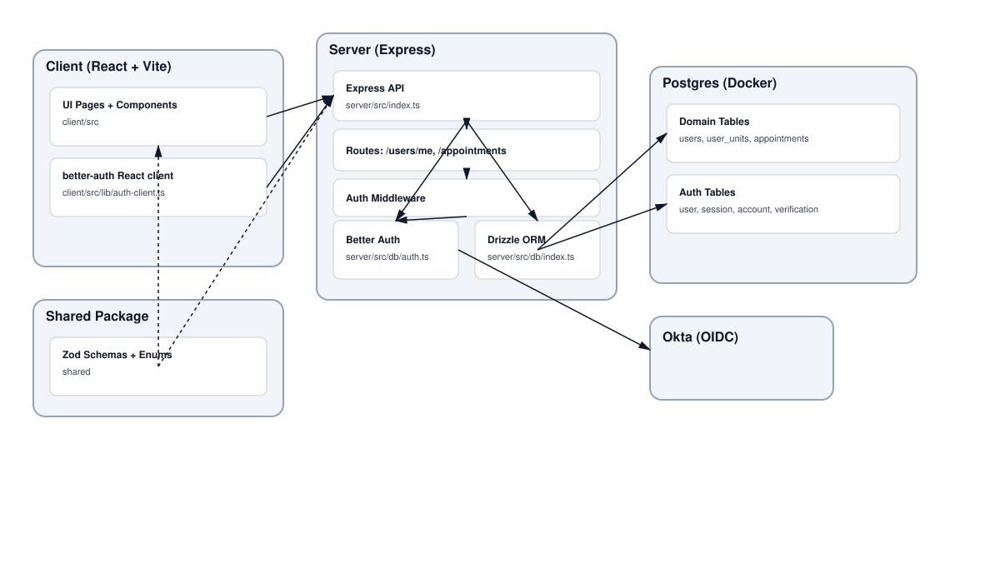

# System Designs - Architecture Diagram (Checkpoint Artifact)

## What artifacts were created and why
We created a system architecture diagram that shows the major components of GradEval360 and how they interact end‑to‑end. This diagram was chosen because our current work spans client, server, auth, and database layers, and a shared view is necessary for implementation decisions and onboarding contributors.

## Key decisions and tradeoffs
- We separate the Client (React/Vite) from the Server (Express) to keep UI concerns decoupled from API logic.
- Authentication is handled via Better Auth with Okta OIDC, which simplifies SSO and reduces custom auth risk.
- Drizzle ORM centralizes DB access, trading a small learning curve for type‑safe queries and schema management.
- Shared Zod schemas are used across client and server to reduce API contract drift.

## How this informs current and future development
This diagram clarifies boundaries between UI, API routes, auth middleware, and database layers. It informs current feature work (appointments, user profile flows) and helps future contributors understand where to add endpoints, how auth is enforced, and how data flows through the system.

## Current vs intended state
Current system matches the diagram for core auth and appointments flows. Planned future work includes expanding domain tables and introducing additional API routes, those will extend the existing server and DB layers shown here.

## Source links
- Diagram source: [architecture.mmd](../architecture.mmd)
- Rendered diagram: [architecture.svg](../architecture.svg)
