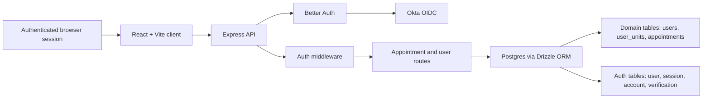

# GradEval360 Threat Model

Last updated: May 3, 2026

## Scope

This threat model covers the current GradEval360 Milestone 2 annual evaluation workflow. The in-scope system includes the React client, Express API, Better Auth and Okta OIDC login flow, Drizzle/Postgres persistence layer, domain users, user-unit assignments, appointment records, evaluation payloads, and contributor-facing project documentation.

The current workflow progresses through:

`AwaitingExpectationSetting -> ExpectationSet -> AwaitingSelfEvaluation -> SelfEvaluationCompleted -> MentorEvaluationCompleted -> AwaitingSignOff -> FinalEvaluated`

This document is a living security artifact. It should be updated whenever authentication, authorization, deployment, data retention, or evaluation workflow behavior changes.

## System Context

GradEval360 is a role-based evaluation platform for Graduate Assistants, mentors, and administrators. The most security-sensitive behavior is not payment processing or public content publishing; it is protecting evaluation records, role-specific actions, and administrative sign-off integrity.

Related architecture references:

- [System architecture diagram](../architecture.svg)
- [Auth tables and flow](../AUTH_TABLES_AND_FLOW.md)
- [Appointment status enum reference](../status-enum.md)

## Primary Assets

- User identity and role claims for GAs, mentors, and admins.
- Session tokens and auth table records created by Better Auth.
- Okta OAuth client configuration and client secret.
- Appointment ownership data: GA ID, mentor ID, unit ID, and appointment code.
- Evaluation data: expectations, GA self-evaluation, mentor evaluation, sign-off decision, sign-off notes, and final acknowledgment.
- Workflow state represented by appointment status.
- Audit-like fields such as `mentorAcknowledgedAt`, `gaAcknowledgedAt`, `evaluationSubmittedBy`, `signOffPreparedBy`, and `finalAcknowledgedBy`.
- Database credentials and local/deployment environment variables.
- Source code, tests, documentation, and contributor workflow templates.

## Actors

- **GA:** Can view assigned appointments, acknowledge expectations, submit self-evaluation, and review final state.
- **Mentor:** Can view assigned appointments, set expectations, and submit mentor evaluation.
- **Admin:** Can view appointments by unit scope and complete final sign-off actions.
- **Unauthenticated attacker:** Attempts to access API routes or login flows without a valid session.
- **Authenticated but unauthorized user:** Has a valid session but attempts to access another role, unit, or appointment.
- **Contributor or maintainer:** Can propose code or documentation changes and may accidentally weaken security.
- **Compromised identity provider or misconfigured Okta app:** Could affect login trust, redirect behavior, or role mapping.

## Trust Boundaries

- Browser to Express API over HTTP in local development and HTTPS in any deployed environment.
- Express API to Better Auth session verification.
- Better Auth to Okta OIDC provider.
- Authenticated user session to domain user lookup by email.
- API route handlers to Postgres through Drizzle ORM.
- Domain authorization checks between GAs, mentors, admins, units, and appointment records.
- Repository contribution boundary between trusted maintainers and external contributors.

## Existing Controls

- Protected API routes call `requireAuth`.
- Session resolution is delegated to Better Auth.
- Okta OAuth is configured through Better Auth generic OAuth.
- Required auth environment variables are checked during server startup.
- Domain user role and unit data are resolved from the database during authenticated requests.
- Appointment access is role-scoped through `canAccessAppointment`.
- Appointment list queries are scoped by GA, mentor, or admin unit access.
- Workflow transitions require the appointment to be in the expected status before mutation.
- Request payloads are validated with shared Zod schemas.
- Database access uses Drizzle ORM instead of string-concatenated SQL for normal queries.
- Testing guidance and contribution docs exist to reduce accidental regressions.

## Assumptions

- Production deployment will use HTTPS and secure cookie settings.
- Okta is the authoritative identity provider for institutional users.
- Role and unit assignments in the domain database are maintained by trusted admins or seed/setup processes.
- Evaluation records may contain sensitive academic or employment-related information.
- External contributors should not receive production secrets or privileged database access.

## Threat Analysis

| ID | STRIDE | Threat | Impact | Likelihood | Current Controls | Recommended Mitigation |
| --- | --- | --- | --- | --- | --- | --- |
| T1 | Spoofing / Elevation of privilege | A user attempts to claim a different role by manipulating client-side session fields or request data. | High | Medium | Server resolves role from domain `users` table in `requireAuth`; route handlers check `user.role`. | Add automated authorization tests for every role/action pair and avoid trusting role values sent by the client. |
| T2 | Information disclosure | A valid user guesses an appointment ID and tries to view another GA or mentor's record. | High | Medium | `GET /appointments/:id` calls `canAccessAppointment`; list queries are role-scoped. | Keep direct-object access tests for GA, mentor, and admin unit boundaries; log repeated forbidden access attempts. |
| T3 | Tampering | A user submits workflow data out of order, such as self-evaluation before GA acknowledgment or sign-off before mentor evaluation. | Medium | Medium | Mutation routes check current appointment status before update. | Add integration tests for invalid transition attempts and document transition rules as security-sensitive. |
| T4 | Tampering / Repudiation | Evaluation payloads are changed without enough evidence of who performed the action. | High | Medium | Several timestamp and actor fields are stored in JSONB payloads. | Add immutable audit events for future production use; include actor ID, action, previous status, next status, and timestamp. |
| T5 | Information disclosure | Sensitive evaluation data is overexposed in list or summary endpoints. | High | Medium | Current summary returns status counts and pending identifiers; list endpoints return appointment records. | Review API response shapes before deployment and return only fields needed by each view. |
| T6 | Spoofing | Okta redirect or trusted origin misconfiguration allows auth flow abuse in deployment. | High | Low to Medium | Better Auth config uses required Okta env vars and local trusted origin. | Replace local trusted origins with environment-specific allowlists and document production redirect URI requirements. |
| T7 | Information disclosure | Secrets such as `OKTA_CLIENT_SECRET`, `BETTER_AUTH_SECRET`, or `DATABASE_URL` are committed or exposed in logs. | High | Medium | README instructs users to create local `.env`; no real secrets are documented. | Add secret scanning in CI and keep example values clearly fake. Never log full environment variables. |
| T8 | Denial of service | Expensive or unbounded appointment list queries degrade performance as records grow. | Medium | Low to Medium | Queries are scoped by role and unit. | Add pagination, filtering limits, and database indexes for `gaId`, `mentorId`, `unitId`, and `status` before scale. |
| T9 | Information disclosure / Elevation of privilege | Admin with no `unitId` or `unitIds` can access all appointments. | High | Medium | `canAccessAppointment` currently permits all appointments for admins with no unit scope. | Decide whether global admin is intentional; if not, require explicit unit scope or a separate super-admin role. |
| T10 | Tampering | JSONB evaluation payloads drift from expected shape or retain legacy fields that confuse UI and reporting. | Medium | Medium | Incoming payloads are validated with shared Zod schemas; status docs describe expected fields. | Add migration and validation checks for existing records; consider structured columns for fields needed in reporting. |
| T11 | Repudiation | Users can dispute whether they acknowledged expectations or final evaluation because acknowledgment fields are stored inside mutable JSONB. | Medium | Medium | Acknowledgment timestamps and actor names are stored. | Store acknowledgment events in a separate append-only table for production-grade auditability. |
| T12 | Supply chain / Tampering | A dependency or contributor PR weakens auth, validation, or route access checks. | High | Medium | Contribution guidelines, PR template, and testing strategy exist. | Require review for auth or workflow files, run tests in CI, and enable dependency/security scanning. |
| T13 | Information disclosure | Local seed identities or logs expose personally identifiable information beyond what contributors need. | Medium | Medium | README lists shared test identities and says credentials must come from approved secret storage. | Keep seed data synthetic where possible and avoid committing real evaluation content. |
| T14 | Cross-site request forgery / session misuse | Browser-based session cookies are used to mutate evaluation records without intentional user action. | High | Low to Medium | Better Auth handles session behavior; routes require authenticated session. | Confirm SameSite, Secure, and CSRF protections for deployment; add tests or documentation for mutation endpoints. |

## Highest Priority Risks

### 1. Role and Unit Authorization Drift

GradEval360's main security boundary is not just login; it is whether each authenticated user can only act on the appointments they are allowed to access. Role and unit checks should be treated as core product behavior. Any route that returns or mutates appointment data should be covered by role-specific tests.

### 2. Evaluation Record Integrity

Evaluation records may be used for administrative decisions. The current JSONB payload model is flexible, but production integrity will require stronger audit trails than mutable fields inside a single appointment record. A future append-only event log would make it easier to answer who changed what and when.

### 3. Deployment Auth Configuration

The current configuration is development-oriented, including local trusted origins. Before deployment, Okta redirect URIs, trusted origins, secure cookies, secrets management, and environment separation need a dedicated review.

## Mitigation Backlog

| Priority | Mitigation | Owner Area |
| --- | --- | --- |
| P0 | Add authorization tests for every role and appointment action. | Server tests |
| P0 | Confirm whether admins without unit scope should have global access. | Product / Security |
| P1 | Add secret scanning and dependency scanning to CI. | DevOps |
| P1 | Review API response shapes to minimize evaluation data exposure. | Client / Server |
| P1 | Document production Okta redirect URI and trusted origin requirements. | Auth docs |
| P2 | Add append-only audit events for workflow transitions and acknowledgments. | Database / Server |
| P2 | Add pagination and indexes for appointment list/reporting queries. | Database / Server |
| P2 | Add data retention and export guidance for evaluation records. | Product / Policy |

## Open Questions

- Should `Admin` mean global administrator, unit administrator, or both?
- What evaluation fields are considered sensitive by SLU policy?
- How long should evaluation records be retained?
- Which users can create appointments, assign mentors, or update unit membership?
- What production environment will host the client, server, database, and Okta application?
- Is final acknowledgment intended to be completed by admin only, or should GA acknowledgment also be required in a later milestone?

## Review Cadence

Review this threat model:

- Before production deployment.
- After changes to auth, roles, appointment status transitions, or evaluation payloads.
- After adding new user roles or admin capabilities.
- After user research reveals changes to the real evaluation process.
- At semester handoff so future teams inherit current security assumptions.
